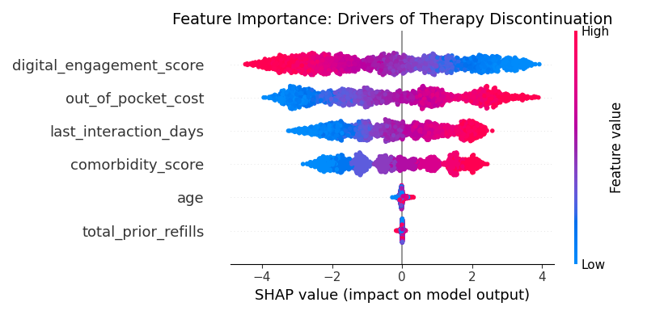

# patient-adherence-ml-framework
Predictive modeling to identify therapy discontinuation risk using XGBoost and SHAP for explainable patient insights
"This framework targets the $30B annual revenue loss in Pharma due to non-adherence. By predicting 'drop-off' with 85%+ accuracy, commercial teams can optimize support programs."

